# 宣传与媒体部

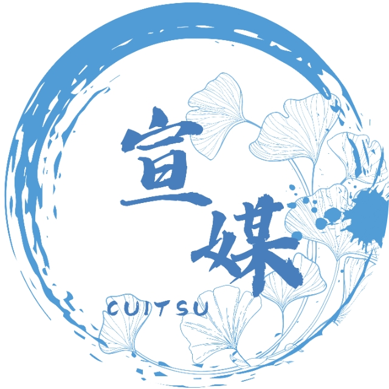

成都信息工程大学学生会宣传与媒体部（以下简称“宣媒”），是负责实现成都信息工程大学学生会对外宣传的职能部门。宣媒部门内下设六大小组，负责不同社交媒体平台的宣传职能。

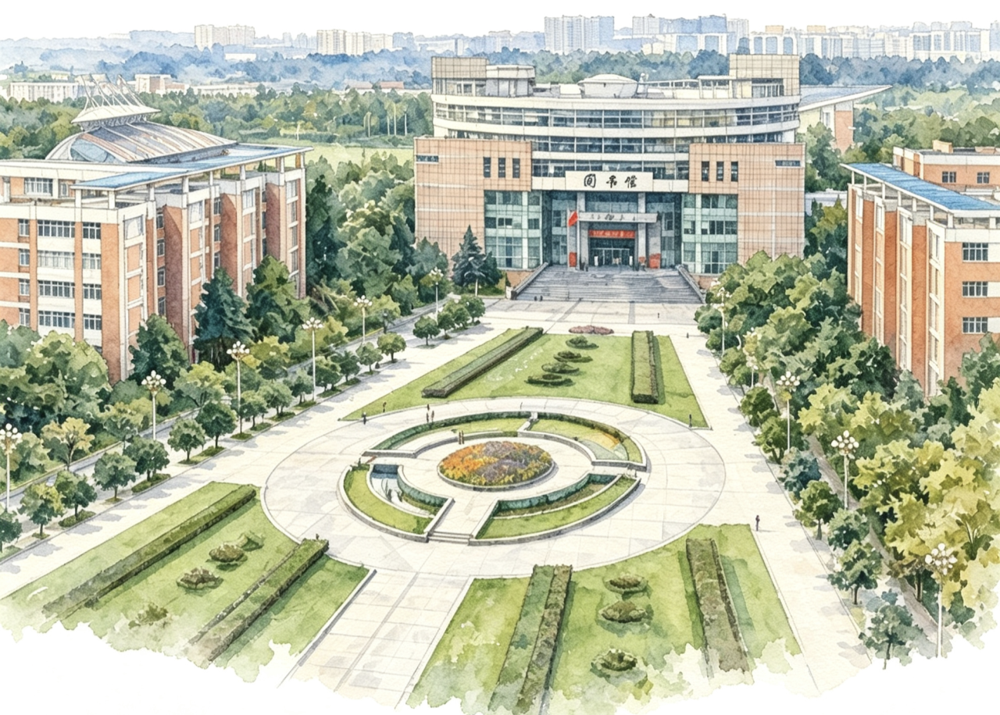

## 视频组🎬

视频组负责抖音、bilibili两个视频平台的宣传职能。

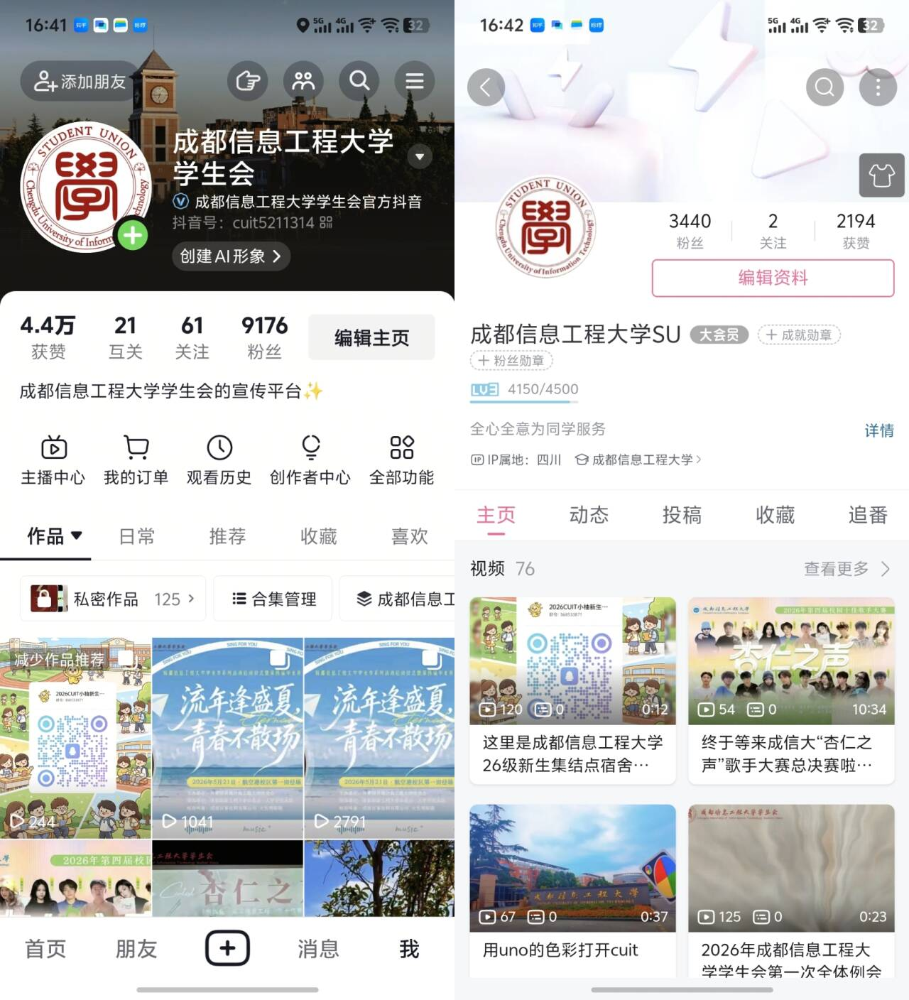

小组主要围绕校园活动、学风宣传、校园风光、学生日常等内容完成全流程创作，从脚本策划、现场拍摄、后期剪辑到平台发布、评论互动均独立完成。迎新晚会、校园十佳歌手、“青春榜样”颁奖典礼暨五四文艺汇演等校级大型活动的纪实短视频、活动高光花絮由本组一手制作；同时结合同学们关心的食堂、宿舍、校园设施等话题产出各类原创视频，借助抖音、B 站的传播优势，直观展示校园风貌与学生会工作，用年轻化短视频形式传递校园正能量，搭建面向全校学生的视频宣传窗口。

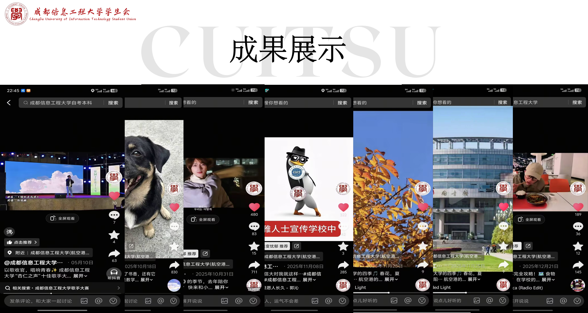

尽管你不会剪辑视频，学长学姐都会耐心教你哦！！只要你热爱视频录制、视频剪辑和媒体账号运营，我们都欢迎你的加入！

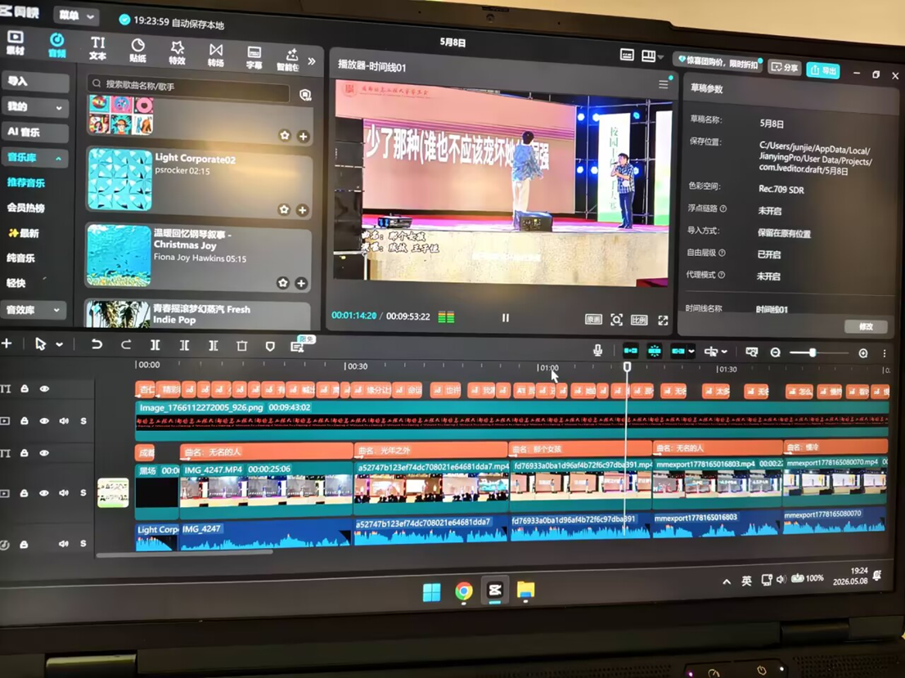

## 微信组📜

微信组是校学生会官方微信公众号的核心运营小组，主打校园图文宣传工作。小组主要负责全校各类校级活动的前期宣传预告、中期活动跟进、后期新闻稿撰写与推文推送，覆盖迎新晚会、校园十佳歌手、文体赛事、主题教育活动、学风建设活动等全部校级活动宣传工作。同时，承担学生代表大会等学校重大会议、重点专项工作的官方推文制作与报道任务，及时对外发布权威、正式的校园资讯与学生会工作动态。

日常工作包含文案撰写、图文排版、内容审核、推文发布与后台维护，以严谨、正式的图文形式记录校园重点活动，传递学生会服务宗旨与校园正能量，是校学生会核心、权威的线上图文宣传阵地。

尽管你不会推文排版工具也有学长学姐教你哦！

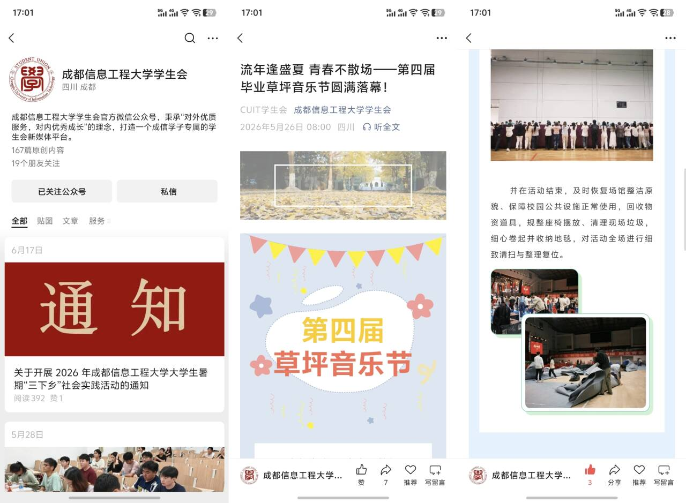

## 小Q组🐧

小 Q 组负责运营学生会小红书、QQ 空间两大图文类线上平台，产出内容以图文形式为主。

围绕各类校园活动、节气节日、校园日常、权益科普等主题策划图文推送，同步发布活动现场实拍、活动预告、校园风景、便民小贴士等内容；整理摄影组实拍图片、美工组设计海报搭配文案排版发布，贴合小红书、QQ 空间年轻化的内容风格，及时和平台评论区同学互动，拓宽学生会线上宣传渠道，以轻松鲜活的图文内容传递校园动态与学生会工作。

小红书：

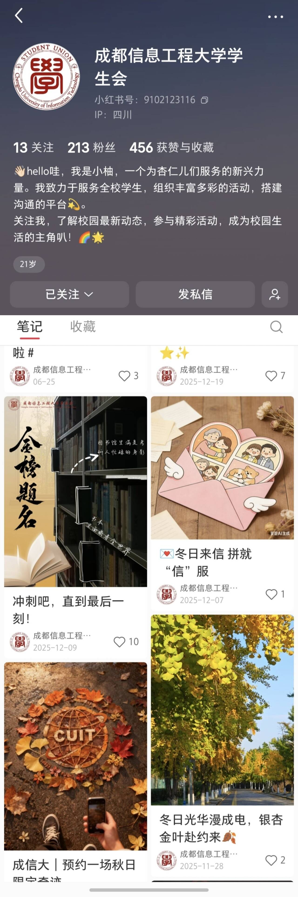

QQ空间：

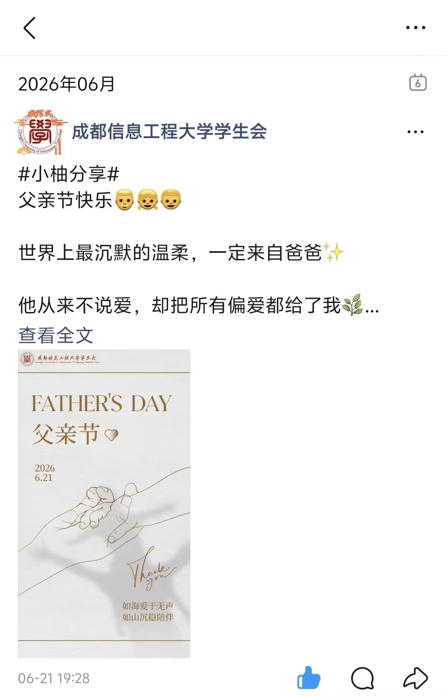

## 美工组🎨

美工组是校学生会视觉内容创作核心团队，负责全品类视觉物料设计产出，覆盖线上宣传、线下活动、部门形象全场景需求。 针对校园各类大型活动，独立完成整套宣传视觉设计，像毕业草坪音乐节、节日主题活动、校级晚会主视觉海报、系列宣传展板、易拉宝均由本组设计；同步产出活动落地所需实用物料，包括活动门票、节目单、舞台背景等，为活动预热、现场布置提供全套设计素材。

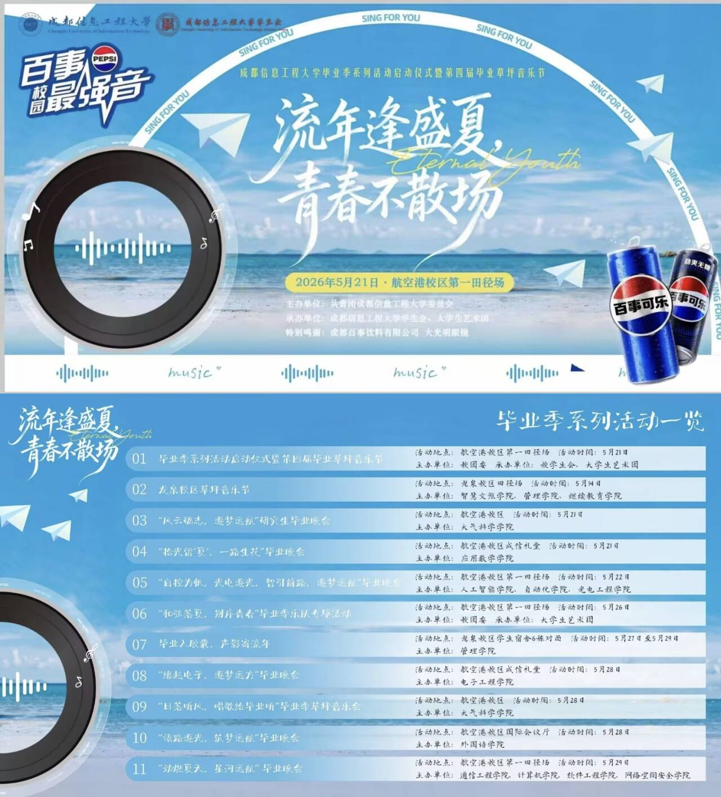

 结合二十四节气、校园节日节点创作专题视觉海报，适配公众号推文、短视频封面等线上平台使用；同时负责学生会内部视觉形象打造，定制专属部门工牌，结合校园热点、学生会日常工作创作主题表情包，用于推文配图、部门线上交流，丰富宣传内容的趣味性。 日常配合文字、视频宣传板块输出配套图片素材，统一规范学生会整体视觉风格，用创意设计展现校园青春风貌，支撑学生会各类宣传工作完整落地。

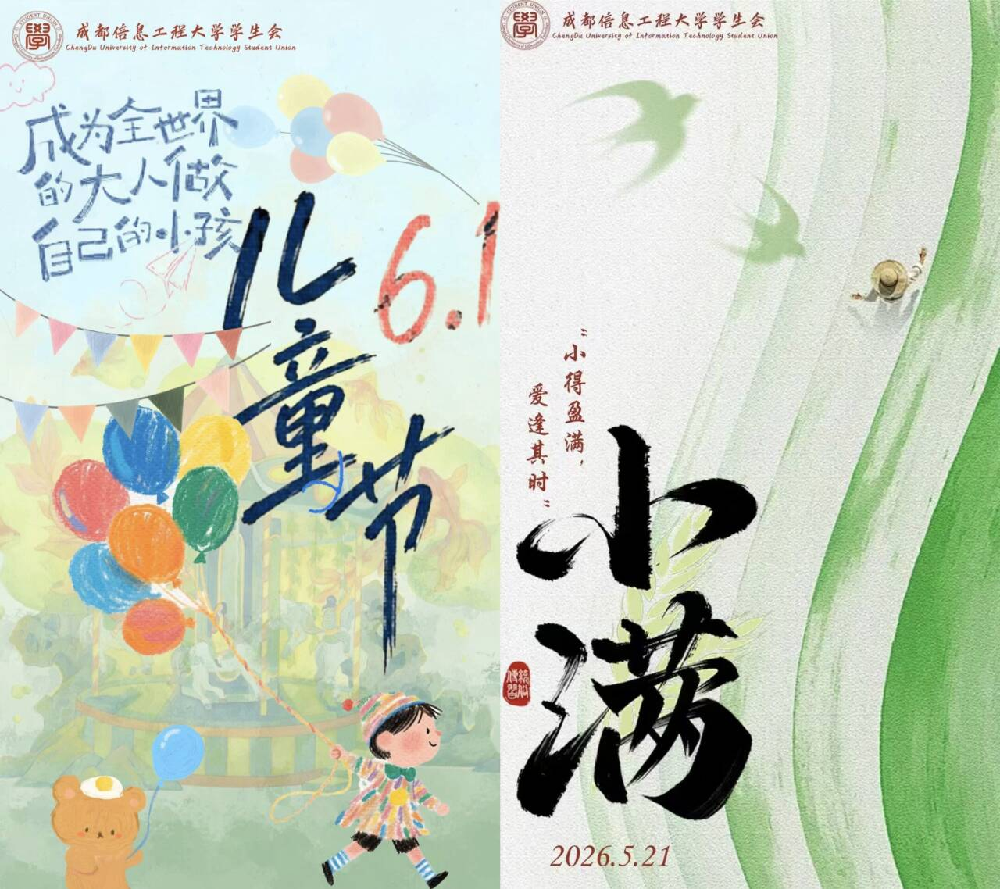

## 摄影组📷

摄影组的主要职能是在学生会举办的各种大型活动中进行照片素材的拍摄，以及校园风光的纪实拍摄。拍摄到的素材提供给其他各组制作海报、推文、插入视频剪辑等。如果你爱好摄影，宣媒摄影组欢迎你！

  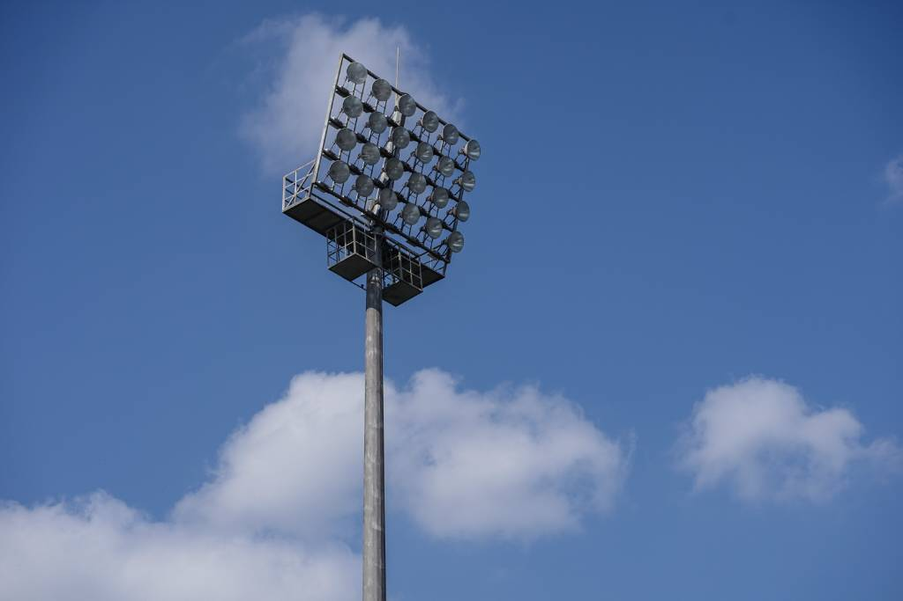  

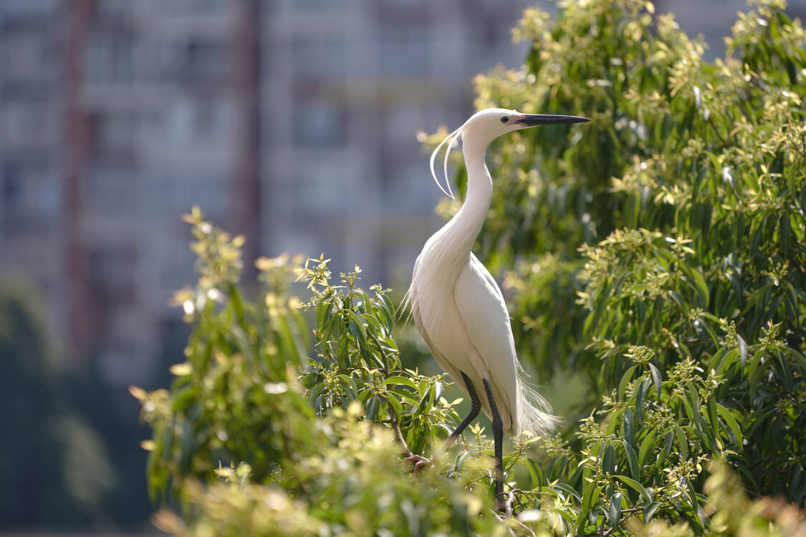 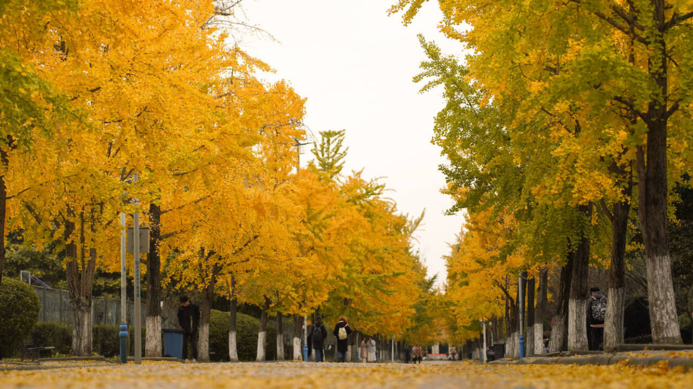

## 文秘组✨

文秘组负责统筹好宣传与媒体部的部门例会、团建、与其他部门对接事宜。

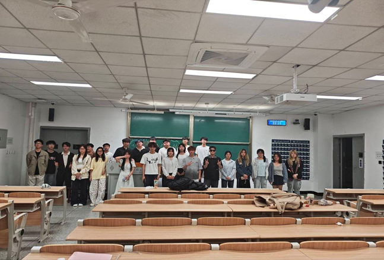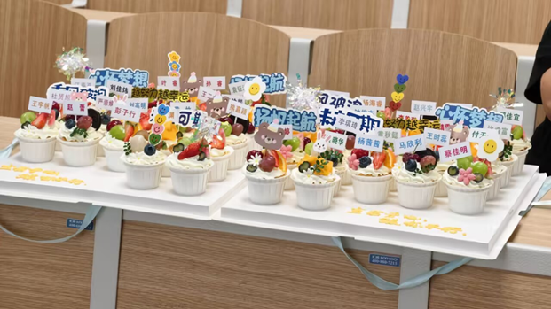

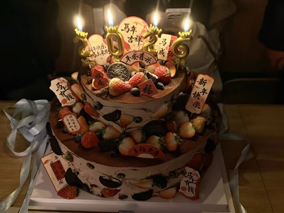

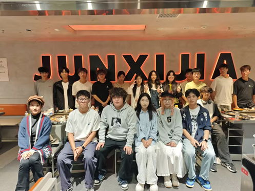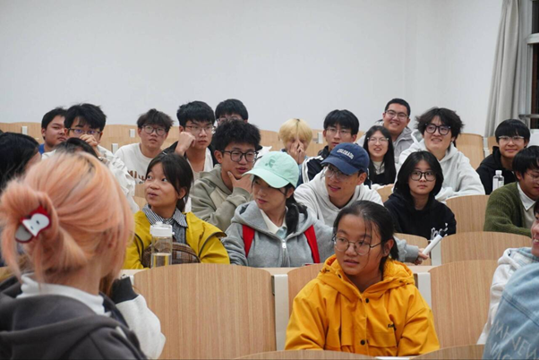

## 加入方式🎊

🎉如果你很幸运在cuit-guide看到了宣媒的介绍，那么恭喜你，只要你扫描下方QQ群二维码，即可获得提前轻松加入的机会！💐宣媒是个很大的大家庭，每年都会招新很多新同学，不要担心自己能力不足而无法加入或有其他顾虑，我们欢迎每一位新生宝宝的到来！任何你不懂的问题学长学姐都会热情耐心解答，帮你解答初入校园时的各种疑问，帮助你少踩许多坑。喵~🥳

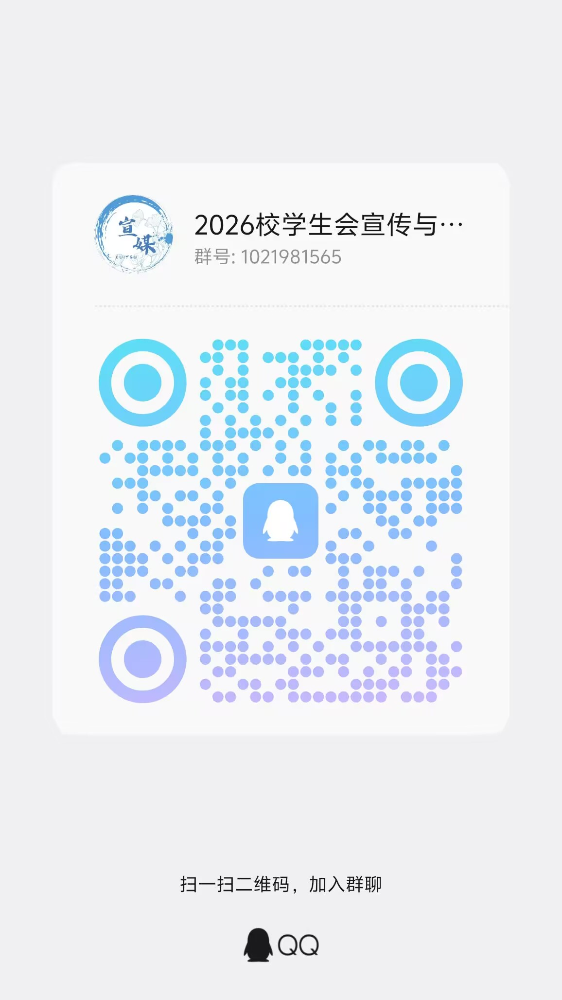

